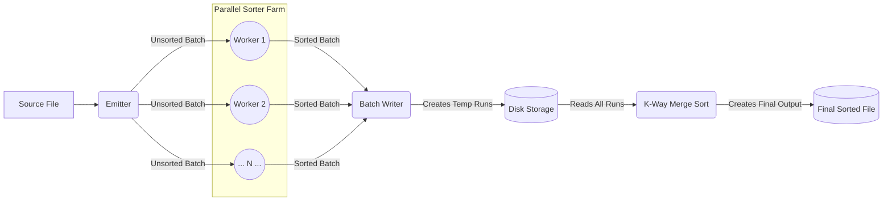

# Scalable Parallel External-Memory Sort

This project provides a high-performance C++23 implementation of a scalable, I/O-optimal, external-memory merge sort algorithm.
It is designed to sort files that are too large to fit into main memory, leveraging stream parallelism with [FastFlow](https://github.com/fastflow/fastflow) to maximize throughput.

The implementation leverages modern C++ features and performance-oriented techniques like memory arenas and buffered I/O to reduce bottlenecks on multi-core systems.



## Setup

This project uses [Nix](https://nixos.org/) to manage all dependencies (C++ compiler, Meson, FastFlow, etc.).

1.  **Clone the repository:**
    ```sh
    git clone <your-repo-url>
    cd spm-project
    ```

2.  **Enter the Nix development shell:**
    This command will automatically download and install all required dependencies into an isolated shell environment.
    ```sh
    nix-shell
    ```

## Build Instructions

Once you are inside the Nix shell, you can build the project using Meson and Ninja.

1.  **Configure the build:**
    ```sh
    meson setup build
    ```

2.  **Compile the project:**
    ```sh
    ninja -C build
    ```
    This command will create the executables in the `build/` directory.

## How to Run

The process involves two steps: generating a random data file and then sorting it.

#### 1. Create Data File

Use the `create_file` executable to generate a binary file with random records.

**Usage:**
```
./build/create_file <num_records> <max_payload_length> <output_path>
```

**Example:**
```sh
./build/create_file 10000000 64 random_data.bin
```

#### 2. Run Parallel Sort

Use the main `spm_project` executable to sort the file.

**Usage:**
```
./build/spm_project <batch_size> <num_workers> <file_to_sort>
```

**Example:**
```sh
./build/spm_project 100000 4 random_data.bin
```
The application will create temporary sorted "run" files in the system's temp directory and produce a final `sorted.bin` file in the project's root directory.

## TODO

### Single-Node (OpenMP Implementation)

### Multi-Node (MPI + FastFlow Implementation)
